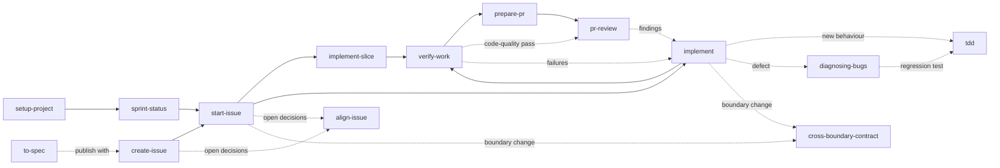

# Skill fleet

A set of agent skills for building software through one workflow: plan an issue, start it, implement it in reviewable slices, verify it, open a pull request, and review it. The skills work in any project, whether a web app, an iOS or Android app, a game, a back-end service, a library, or a mix of these in one repository or several.

## How it works: GitHub issues on one board

skill-fleet is opinionated about where work lives. Every project that uses it runs its work through GitHub, and the installer sets that up for you:

- **A GitHub repository.** Issues and pull requests live there. The installer stops when the project folder is not a GitHub repository, and shows how to create one.
- **The GitHub CLI (`gh`), logged in.** The skills and their scripts talk to GitHub through it. When `gh` is missing, the installer offers to install it, with Homebrew on macOS or winget on Windows, and otherwise points to [cli.github.com](https://cli.github.com). When `gh` is not logged in, or its login lacks the `project` scope the board needs, it offers to fix that in your browser.
- **A GitHub Project board linked to the repository.** The board has a `Status` field with the options `Todo`, `In progress`, `In review`, and `Done`, and a `Sprint` field with two-week sprints. When the repository has no linked board, the installer creates one called `<repository> Sprints`, or links one of your existing boards if you pick it. When a linked board lacks a status option or the Sprint field, it adds them without touching the options already in use. It asks before it creates, links, or repairs a board.

The skills then move each issue across the board:

| Status | Set by |
| --- | --- |
| `Todo` | `create-issue`, when it files the issue |
| `In progress` | `start-issue`, when work begins on a branch |
| `In review` | `prepare-pr`, when the pull request is ready for review |
| `Done` | GitHub's built-in project workflow, when the issue closes |

`sprint-status`, `sprint-recap`, and `repos-report` read the Sprint field to report on the current sprint. The board is not optional. When it is missing or incomplete, a skill stops and asks you to run `npx skill-fleet@latest update`, which creates or repairs it. The command changes the project board on GitHub, so it runs only with your approval, after a `--dry-run` preview. The board starts with six sprints, about three months; add more in the Sprint field's settings on GitHub when they run out.

## How one skill set fits every project

Three layers keep the skills general:

| Layer | Lives in | Holds | Changes when |
| --- | --- | --- | --- |
| Skills | `skills/` → a project's `.agents/skills/` | The workflow: what to read, what to check, what never to do without approval | The workflow improves |
| Project profile | a project's `docs/agents/` | Tracker, board, lifecycle statuses, routing, reading order, boundaries, commands, evidence, protected files | The project changes |
| Shared references | `references/` → a project's `.agents/references/` | The 16 quality characteristics, GitHub link rules, subagent rules, and one guide per platform | The model or a platform's practice changes |

A skill never says "run `npm run build`" or "move the issue on the Roadmap board". It says "run the final verification in `docs/agents/verification.md`" and "move the issue to the started status on the board in `docs/agents/issue-tracker.md`". The [project profile reference](references/project-profile.md) defines the three profile files and how skills treat a missing, `TODO`, or `None` value.

Platform differences live in the [platform guides](references/platforms/README.md): `web`, `mobile`, `desktop`, `game`, `service`, and `library-cli`. Each gives the default test seams, runtime evidence, bug feedback loops, compatibility risks, and visible-first build order for that kind of software. The profile names each component's platform, so `verify-work` knows that a web change needs a browser pass, an iOS change needs simulator and device evidence kept apart, and a game change needs a play-test and a profiler capture on target hardware.

## Install into a project

Run the installer from the project's root folder with any package manager. It needs Node.js 20 or later:

```sh
npx skill-fleet@latest        # npm
pnpm dlx skill-fleet@latest   # pnpm
yarn dlx skill-fleet@latest   # Yarn 2 or later; with Yarn 1, use npx
bunx skill-fleet@latest       # Bun
```

It first checks GitHub as described [above](#how-it-works-github-issues-on-one-board): the GitHub CLI, its login, the repository, and the board. Then it asks three questions, sets up the board, and copies the fleet into the project so the project stays self-contained for collaborators who never run the installer:

1. **Which coding tools should get skill adapters?** Claude Code, Cursor, and Kiro each read skills from their own folder, so each gets a thin adapter that points at the canonical skill. Codex and OpenCode read `.agents/skills/` directly and need none.
2. **Create or update `AGENTS.md` and `CLAUDE.md`?** Described below.
3. **Overwrite the conflicting files?** Asked only when a file the fleet would write already exists and the fleet did not write it, or you changed it since. The answer defaults to no.

Commit the project before you install or update. A file the fleet overwrites keeps its earlier version only in Git, and `setup-project` reads it there to carry its project facts into the profile.

When several boards could serve the repository, it also asks which one to use, and it asks before it creates, links, or repairs the board. `--yes` skips every question. It keeps the choices recorded by the last installation, or uses Claude Code, Cursor, and the instruction files the first time, and it makes the board changes the workflow needs.

Without a terminal, such as in CI, the installer asks nothing and keeps the recorded choices, but it changes the board only with `--yes`, or, for a link, with the board named by `--board`. A run that would change the board without that consent lists the planned board changes, writes nothing on GitHub or on disk, and exits with an error. Rerun it in a terminal or with `--yes`. When no board is linked, `--yes` links the board the last installation recorded again, if the owner still has it open. Otherwise it creates a new board, unless an open board of the owner already has that title, which would leave two boards the sprint skills cannot tell apart. Then it stops and asks you to name that board with `--board`. To use any other existing board, name it with `--board`.

Flags answer a single question instead:

| Flag | Effect |
| --- | --- |
| `--claude`, `--cursor`, `--kiro`, or `--tools claude,cursor` | Choose the tools; `--tools none` writes no adapters |
| `--instructions`, `--no-instructions` | Create and update `AGENTS.md` and `CLAUDE.md`, or leave both alone |
| `--force` | Overwrite conflicting files without asking, and run over an installation made by a newer version |
| `--board <number or title>` | Use this board of the repository's owner, linking it to the repository. Naming the board approves the link, also without a terminal |
| `--dry-run` | Show what would change, on GitHub and on disk, and change nothing. Conflicting files are listed with the rest, and the dry run fails when they would stop the real run |

The installer writes:

- `.agents/skills/`: the canonical skills;
- `.claude/skills/`, `.cursor/skills/`, or `.kiro/skills/`: the adapters for the tools you chose;
- `.agents/references/`: the shared references;
- `.agents/scripts/check-skills.mjs`: a checker anyone can run with `node .agents/scripts/check-skills.mjs`;
- `.agents/skill-fleet-LICENSE`: the fleet's licence, which travels with the copies;
- `.agents/skill-fleet.json`: the version, the choices, and a hash of every file it wrote;
- `AGENTS.md` and `CLAUDE.md`: the project's instruction files, described below;
- `docs/agents/issue-tracker.md`, when it does not exist yet: the repository, owner type, board, lifecycle statuses, Sprint field, sprint time zone, and base branch, as read from GitHub. `setup-project` adds the routing and labels.

It never changes an existing `docs/agents/` file and writes nothing else there. The profile belongs to the project.

### AGENTS.md and CLAUDE.md

Every coding agent reads `AGENTS.md` first, and Claude Code reads `CLAUDE.md`. The installer handles both so a new project works at once:

- A project without `AGENTS.md` gets one from [the template](skills/setup-project/templates/AGENTS.template.md), headed with the project's name and linked to its GitHub repository, both read from its Git remote. The parts only a reader of the code can write, such as what the product is, where the source of truth lives, and the project's own safety rules, stay `TODO` until `setup-project` fills them.
- A project without `CLAUDE.md` gets one that imports `AGENTS.md`, when Claude Code is one of the chosen tools. An existing `CLAUDE.md` that lacks the import gets it added at the top.
- Both files carry a section between `<!-- skill-fleet:begin -->` and `<!-- skill-fleet:end -->` markers. In `AGENTS.md` it explains the workflow and where the profile lives. It tells agents not to edit by hand the files `.agents/skill-fleet.json` records, while the project's own skills can sit beside them, and to ask you before running the installer, because the installer can change the board. The installer rewrites only that section on every update, and adds it to an `AGENTS.md` you wrote yourself without touching the rest.

If you edit the section by hand, the next install reports a conflict rather than overwrite your change. If you delete it, the installer leaves it out from then on, unless you pass `--force`.

### Updates, checks, and workspaces

```sh
npx skill-fleet@latest update            # update an existing installation
npx skill-fleet@latest update --dry-run  # preview the update
npx skill-fleet@latest check             # verify adapters, hashes, and links
npx skill-fleet@latest list              # list the skills
```

Each command takes the project folder as an optional argument, such as `npx skill-fleet@latest update ../my-app`, and defaults to the current folder. `update` asks the same questions with your previous answers selected. It checks GitHub again, recreating or repairing the board when it changed, updates changed files, removes files the fleet no longer ships, and leaves unchanged files alone. It never overwrites a file it did not write without asking, so a project that already has its own skills with the same names is safe.

`install` and `update` refuse to run when the project's `.agents/skill-fleet.json` records a newer version than the one running, because the older version would replace newer skills with older ones. The message names both versions. Run `npx skill-fleet@<recorded version> update`, or `npx skill-fleet@latest update` once that version is published. `--force` runs the older version anyway, and also overwrites conflicting files.

When `--force`, or a yes to the overwrite question, replaces files the fleet did not install, the installer lists them after the installation. Their previous versions remain in Git if they were committed, and `setup-project` reads them to carry any project facts into `docs/agents/` before they are lost.

`update` and `check` print a note, never an error, for paths in `.agents/skills/` that the manifest does not record: a skill folder the fleet did not install, or a file inside a fleet skill folder, such as a script left over from an earlier hand-made copy. You can delete a leftover. A project's own skill can stay. The check requires adapters only for the skills the manifest records, so a project's own skill passes with its own adapters or none. Its frontmatter and links must still pass the check.

After an install or update, the installer lists what `setup-project` still has to do: profile files that are missing, `TODO`s, and settings the templates in `skills/setup-project/templates/` have that the project's profile files lack. It compares the first column of each settings table and the columns of the routing and boundaries tables, so the list names any row or column a newer template added after the profile was written. In `verification.md` it compares each component section on its own. The list names a whole routing or boundaries table when the file has neither the table nor its heading. A heading that records `None`, as in a project without boundaries, is enough.

In a workspace that holds several independent repositories, install at the workspace root, where cross-repository work starts. Install into a child repository as well only if people also open it on its own. Each installation then needs its own profile. The board links to the workspace repository, and issues from every child repository of the same owner can sit on it.

To try an unreleased version, run the installer straight from GitHub with `npx github:chustert/skill-fleet`, or from a clone with `node bin/skill-fleet.mjs install <project>`.

## Adapt it to the project

Open the project in your coding agent and run `setup-project`. It inspects the repositories, GitHub tracker, board, components, commands, services, secret files, and documentation, and fills in the three profile files:

- `docs/agents/issue-tracker.md`
- `docs/agents/domain.md`
- `docs/agents/verification.md`

`domain.md` lists the boundaries between parts that ship separately, with a `Local check` that runs both sides together, and `verification.md` records each component's commands, runtime evidence, and what a merge `Deploys`. When the project already had its own skills or docs, `setup-project` reads their earlier versions from Git and proposes a profile row for each project fact they held.

It then replaces the `TODO`s in the `AGENTS.md` the installer created, and checks that `CLAUDE.md` imports it. When you wrote `AGENTS.md` yourself, it only proposes additions, as a diff for your approval.

It reads GitHub but never changes it, never opens secret files, and asks you to confirm the judgement calls: which board, how components map to repositories, the lifecycle statuses, the quality weighting, and what the product is. You can also fill the files by hand from the templates in `skills/setup-project/templates/`.

A project without a test runner, a glossary, or a contracts document is fine. Record `None`, and the skills skip the dependent step and say so instead of failing. The board is the exception: the installer always sets it up.

## The workflow



Invoke a skill as `/name` in Claude Code and Cursor, or `$name` in Codex.

### Once per project

| Skill | What it does | Example prompt | Suggested models |
| --- | --- | --- | --- |
| `setup-project` | Inspects the project and writes the profile the other skills read. Rerun it when the board, structure, or commands change. | `/setup-project` | High-tier model, such as Opus 5 High or GPT-5.6-Sol High |

### Preparation

| Skill | What it does | Example prompt | Suggested models |
| --- | --- | --- | --- |
| `sprint-status` | Summarizes your sprint, active work, and PR review queue. | `/sprint-status` | Cheap model, such as Grok 4.6 or GPT-5.6-Luna |
| `sprint-recap` | Recaps issues created, PRs opened and merged, reviews, and merge time during a sprint or a date window. | `/sprint-recap` | Same as `sprint-status` |
| `repos-report` | Shows icon-coded at-a-glance tables of each repository's branches and worktrees, what is active or dormant, and where each open sprint issue lives locally. Fetches and prunes remote-tracking refs in each clone unless run with `--no-fetch`, and changes no branch, worktree, or file. | `/repos-report` | Same as `sprint-status` |
| `create-issue` | Creates a grounded issue in the right repository, with existing labels and the board's first status. | `/create-issue Create an issue for: [problem, expected behaviour, and reproduction steps].` | Cheap model, such as Grok 4.6 or GPT-5.6-Luna |
| `to-spec` | Turns the current discussion into a written specification. | `/to-spec` | High-tier model |

The sprint scripts cover the repositories in the routing table of `docs/agents/issue-tracker.md`, or its `Default repository` while the table has no `Repository` column. They never fall back to every repository the owner has; `--all-repos` asks for that explicitly. The skills pass the profile's `Sprint time zone`. When it is missing, each script warns and records `timezoneDefaulted` in its output.

### Task workflow

| Step | Skill | What it does | Example prompt | Suggested models |
| :---: | --- | --- | --- | --- |
| 1 | `start-issue` | Reads the issue, plans the slices, creates the branch, assigns you, and sets the started status. | `/start-issue https://github.com/<owner>/<repo>/issues/12` | High-tier model, such as Opus 5 High/XHigh or GPT-5.6-Sol High/XHigh |
| 2 | `implement` | Implements the issue in small, verified steps without committing, and explains how to test each step by hand. | `/implement #12 according to the issue and agreed plan.` | Mid- to low-tier model, such as Grok 4.6, GLM 5.3-Flash, or GPT-5.6-Sol Medium |
| 2 (alt.) | `implement-slice` | Implements one slice, explains it, lists how to test it by hand, and waits for "continue". | `/implement-slice #12` | Same as `implement` |
| 3 | `verify-work` | Verifies acceptance criteria, commands, runtime behaviour on each platform, and code quality. | `/verify-work Verify the implementation for #12.` | Same as `implement` |
| 4 | `prepare-pr` | Checks the branch and drafts the PR for your approval before publishing anything. | `/prepare-pr Prepare the current branch's PR for #12.` | Same as `implement`, possibly at lower effort |
| 5 | `pr-review` | Independently reviews a PR and posts the findings as one comment. | `/pr-review https://github.com/<owner>/<repo>/pull/13` | High-tier model, such as Opus 5 High/XHigh or GPT-5.6-Sol High/XHigh |

### Used by other skills

`align-issue`, `cross-boundary-contract`, `tdd`, `diagnosing-bugs`, `technical-writing`, and `unslop` run from inside the workflows above. You can also invoke them directly, for example `/diagnosing-bugs` for a defect or `/teach` to be walked through code.

## Limits

- The tracker is GitHub: issues, sub-issues, and a Projects board. Another tracker, such as Jira or Linear, is not supported.
- The installer and the scripts it copies into projects need Node.js 20 or later and nothing else from npm. The sprint and `repos-report` scripts also need the GitHub CLI, authenticated with the `read:project` scope.
- Adapters are generated for Claude Code, Cursor, and Kiro. Codex and OpenCode read `.agents/skills/` directly.
- The skills report physical-device, target-hardware, and play-test checks as steps for a person to run. They never claim those checks passed on the strength of a build or an editor run.

## License

The skill fleet is released under the [MIT License](LICENSE). Anyone may use, change, and share it, including in commercial work, as long as the copyright notice stays with the copies.

Three skills contain text by other authors, also under the MIT License. Each carries its original notice in a `LICENSE` file in its folder, which the installer copies with the skill:

| Skill | Source |
| --- | --- |
| `unslop` | Copied from the pstack plugin by Lauren Tan |
| `technical-writing` | Adapted from the pstack plugin by Lauren Tan |
| `to-spec` | Specification template adapted from Matt Pocock's `to-spec` skill |

`align-issue` credits Matt Pocock's grilling skill for the interview pattern it follows, in its own words.

## Developing the fleet

[AGENTS.md](AGENTS.md) holds the rules for changing the fleet and the release steps. Run the tests with:

```sh
npm test
```

A GitHub Action runs them on Linux, macOS, and Windows with Node.js 20, 22, and 24. Pushing a version tag, such as `v1.2.0`, stages that version on npm. It goes live only after the maintainer approves it with two-factor authentication, so a leaked GitHub credential cannot publish a release on its own.
