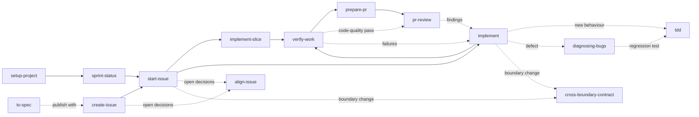

# Skill fleet

A set of agent skills for building software through one workflow: plan an issue, start it, implement it in reviewable slices, verify it, open a pull request, and review it. The skills work in any project, whether a web app, an iOS or Android app, a game, a back-end service, a library, or a mix of these in one repository or several.

The workflow came from two projects that each carried a hand-adapted copy. This fleet keeps the workflow and moves every project fact out of the skills.

## How one skill set fits every project

Three layers keep the skills general:

| Layer | Lives in | Holds | Changes when |
| --- | --- | --- | --- |
| Skills | `skills/` → a project's `.agents/skills/` | The workflow: what to read, what to check, what never to do without approval | The workflow improves |
| Project profile | a project's `docs/agents/` | Tracker, board, lifecycle statuses, routing, reading order, boundaries, commands, evidence, protected files | The project changes |
| Shared references | `references/` → a project's `.agents/references/` | The 16 quality characteristics, GitHub link rules, and one guide per platform | The model or a platform's practice changes |

A skill never says "run `npm run build`" or "move the issue on the Sprints board". It says "run the final verification in `docs/agents/verification.md`" and "move the issue to the started status on the board in `docs/agents/issue-tracker.md`". The [project profile reference](references/project-profile.md) defines the three profile files and how skills treat a missing, `TODO`, or `None` value.

Platform differences live in the [platform guides](references/platforms/README.md): `web`, `mobile`, `desktop`, `game`, `service`, and `library-cli`. Each gives the default test seams, runtime evidence, bug feedback loops, compatibility risks, and visible-first build order for that kind of software. The profile names each component's platform, so `verify-work` knows that a web change needs a browser pass, an iOS change needs simulator and device evidence kept apart, and a game change needs a play-test and a profiler capture on target hardware.

## Install into a project

The installer copies the fleet into the project, so the project stays self-contained for collaborators who do not have this repository.

```sh
git clone https://github.com/chustert/skill-fleet.git
cd skill-fleet
python3 scripts/fleet.py install ~/path/to/project
```

It writes:

- `.agents/skills/`: the canonical skills, which Codex and OpenCode read directly;
- `.claude/skills/` and `.cursor/skills/`: thin adapters that point at the canonical skills. Add `--harness kiro` for `.kiro/skills/`;
- `.agents/references/`: the shared references;
- `.agents/scripts/check_skills.py`: a checker collaborators can run without this repository;
- `.agents/skill-fleet.json`: the version, tools, and a hash of every file it wrote;
- `AGENTS.md` and `CLAUDE.md`: the project's instruction files, described below.

It never writes anything in `docs/`. The profile there belongs to the project.

### AGENTS.md and CLAUDE.md

Every coding agent reads `AGENTS.md` first, and Claude Code reads `CLAUDE.md`. The installer handles both so a new project works at once:

- A project without `AGENTS.md` gets one from [the template](skills/setup-project/templates/AGENTS.template.md), headed with the project's name and linked to its GitHub repository, both read from its Git remote. The parts only a reader of the code can write, such as what the product is, where the source of truth lives, and the project's own safety rules, stay `TODO` until `setup-project` fills them.
- A project without `CLAUDE.md` gets one that imports `AGENTS.md`, when Claude Code is one of the chosen tools. An existing `CLAUDE.md` that lacks the import gets it added at the top.
- Both files carry a section between `<!-- skill-fleet:begin -->` and `<!-- skill-fleet:end -->` markers. In `AGENTS.md` it explains the workflow, where the profile lives, and which files not to edit by hand. The installer rewrites only that section on every update, and adds it to an `AGENTS.md` you wrote yourself without touching the rest.

If you edit the section by hand, the next install stops with a conflict rather than overwrite your change. If you delete it, the installer leaves it out from then on, unless you pass `--force`.

### Workspaces and updates

In a workspace that holds several independent repositories, install at the workspace root, where cross-repository work starts. Install into a child repository as well only if people also open it on its own. Each installation then needs its own profile.

It refuses to overwrite a file it did not write, or one edited since it wrote it, and writes nothing at all when any such conflict exists. A project that already has its own skills with the same names is therefore safe. `--dry-run` shows the plan, and `--force` overwrites conflicts after you have decided to.

To update a project after changing the fleet, run the same command again. It updates changed files, removes files the fleet no longer ships, and leaves unchanged files alone. It remembers the tools you chose.

```sh
python3 scripts/fleet.py install ~/path/to/project --dry-run   # preview
python3 scripts/fleet.py check ~/path/to/project               # verify adapters, hashes, and links
python3 scripts/fleet.py list                                  # list the skills
```

## Adapt it to the project

Open the project in your coding agent and run `setup-project`. It inspects the repositories, GitHub tracker, board, components, commands, services, secret files, and documentation, and fills in the three profile files:

- `docs/agents/issue-tracker.md`
- `docs/agents/domain.md`
- `docs/agents/verification.md`

It then replaces the `TODO`s in the `AGENTS.md` the installer created, and checks that `CLAUDE.md` imports it. When you wrote `AGENTS.md` yourself, it only proposes additions, as a diff for your approval.

It reads GitHub but never changes it, never opens secret files, and asks you to confirm the judgement calls: which board, how components map to repositories, the lifecycle statuses, the quality weighting, and what the product is. You can also fill the files by hand from the templates in `skills/setup-project/templates/`.

A project without a board, without sprints, or without a test runner is fine. Record `None`, and the skills skip the dependent step and say so instead of failing.

## The workflow



Invoke a skill as `/name` in Claude Code and Cursor, or `$name` in Codex.

### Once per project

| Skill | What it does | Example prompt | Suggested models |
| --- | --- | --- | --- |
| `setup-project` | Inspects the project and writes the profile the other skills read. Rerun it when the board, structure, or commands change. | `/setup-project` | High-tier model, such as Opus 5 High or GPT-5.6-Sol High |

### Preparation

| Skill | What it does | Example prompt | Suggested models |
| --- | --- | --- | --- |
| `sprint-status` | Summarizes your sprint, active work, and PR review queue. Works on boards without sprints, and without a board. | `/sprint-status` | Cheap model, such as Grok 4.6 or GPT-5.6-Luna |
| `sprint-recap` | Recaps issues created, PRs opened and merged, reviews, and merge time during a sprint or a date window. | `/sprint-recap` | Same as `sprint-status` |
| `create-issue` | Creates a grounded issue in the right repository, with existing labels and the board's first status. | `/create-issue Create an issue for: [problem, expected behaviour, and reproduction steps].` | Cheap model, such as Grok 4.6 or GPT-5.6-Luna |
| `to-spec` | Turns the current discussion into a written specification. | `/to-spec` | High-tier model |

### Task workflow

| Step | Skill | What it does | Example prompt | Suggested models |
| :---: | --- | --- | --- | --- |
| 1 | `start-issue` | Reads the issue, plans the slices, creates the branch, assigns you, and sets the started status. | `/start-issue https://github.com/<owner>/<repo>/issues/12` | High-tier model, such as Opus 5 High/XHigh or GPT-5.6-Sol High/XHigh |
| 2 | `implement` | Implements the issue in small, verified steps without committing, and explains how to test each step by hand. | `/implement #12 according to the issue and agreed plan.` | Mid- to low-tier model, such as Grok 4.6, GLM 5.3-Flash, or GPT-5.6-Sol Medium |
| 2 (alt.) | `implement-slice` | Implements one slice, explains it, lists how to test it by hand, and waits for "continue". | `/implement-slice #12` | Same as `implement` |
| 3 | `verify-work` | Verifies acceptance criteria, commands, runtime behaviour on each platform, and code quality. | `/verify-work Verify the implementation for #12.` | Same as `implement` |
| 4 | `prepare-pr` | Checks the branch and drafts the PR for your approval before publishing anything. | `/prepare-pr Prepare the current branch's PR for #12.` | Same as `implement`, possibly at lower effort |
| 5 | `pr-review` | Independently reviews a PR and posts the findings as one comment. | `/pr-review https://github.com/<owner>/<repo>/pull/13` | High-tier model, such as Opus 5 High/XHigh or GPT-5.6-Sol High/XHigh |

### Used by other skills

`align-issue`, `cross-boundary-contract`, `tdd`, `diagnosing-bugs`, `technical-writing`, and `unslop` run from inside the workflows above. You can also invoke them directly, for example `/diagnosing-bugs` for a defect or `/teach` to be walked through code.

## What changed from the project copies

- `cross-boundary-contract` replaces `cross-repository-contract` and `cross-component-contract`. It covers independent repositories and separately deployed components, and adds installed apps, save files, multiplayer protocols, library APIs, and CLI output formats.
- `setup-project` is new. It replaces the hand-adaptation each project needed.
- Routing, board, lifecycle statuses, issue types, base branch, and time zone come from `docs/agents/issue-tracker.md`. Issue types are used only when the owner is an organization that has them.
- `create-issue` and `prepare-pr` use the repository's own issue forms and pull-request template when it has them.
- `verify-work` gathers evidence per platform through the platform guides, instead of fixed web and iOS sections, and keeps device, hardware, play-test, and paid-service limits apart.
- `tdd` has a documented fallback for components without a test runner.
- `teach` works visible-first rather than front-end-first: the screen, the playable greybox, the command line, or the usage example, depending on the platform.
- The sprint scripts take the owner, board, fields, and status names as flags, detect organization or user owners, and work on boards without iterations or without a board. `sprint-recap` also accepts `--since` and `--until`.

## Moving an existing project onto the fleet

The installer will not overwrite skills it did not write, so a project that already carries adapted copies keeps them until you move it deliberately:

1. Run `setup-project`'s inspection by hand, or copy the existing tracker, routing, reading-order, contract, command, and secret-file facts into the three profile files from the templates.
2. Delete the project's own copies of the skills and adapters that the fleet replaces, including the renamed contract skill.
3. Run `python3 scripts/fleet.py install <project>`, then `python3 .agents/scripts/check_skills.py` in the project.
4. The installer adds its section to the project's existing `AGENTS.md` and leaves the rest alone. Remove the project's own text that the section now covers, and point references to the project's copy of the quality characteristics at `.agents/references/software-quality-characteristics.md`.
5. Run a smoke test in each coding agent: ask for the tracker, board, protected files, and one component's verification commands, then list the skills.

## Limits

- The tracker is GitHub: Issues, sub-issues, and optionally a Projects board. Another tracker needs its own versions of the tracker steps and sprint scripts.
- The sprint scripts need the GitHub CLI, authenticated with the `read:project` scope, and Python 3.9 or later. They use only the standard library.
- Adapters are generated for Claude Code, Cursor, and Kiro. Codex and OpenCode read `.agents/skills/` directly.
- The skills report physical-device, target-hardware, and play-test checks as steps for a person to run. They never claim those checks passed on the strength of a build or an editor run.

## Developing the fleet

[AGENTS.md](AGENTS.md) holds the rules for changing the fleet. Run every test with:

```sh
python3 -m unittest discover -s tests
python3 -m unittest discover -s skills/sprint-status/scripts
python3 -m unittest discover -s skills/sprint-recap/scripts
```
